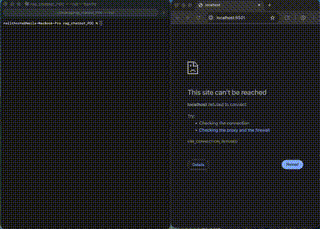

# Rag Chatbot - Proof of Concept
Tech used: Hugging Face, FAISS, Streamlit

## Getting Up and Running
1. `cd` into the project, build the image, and run the container

       docker build -t rag-chatbot . && docker run -it -p 8501:8501 rag-chatbot

2. Within the container, start up `Streamlit`

       streamlit run app.py 

3. On your host machine, connect via a web browser at:

       http://localhost:8501

